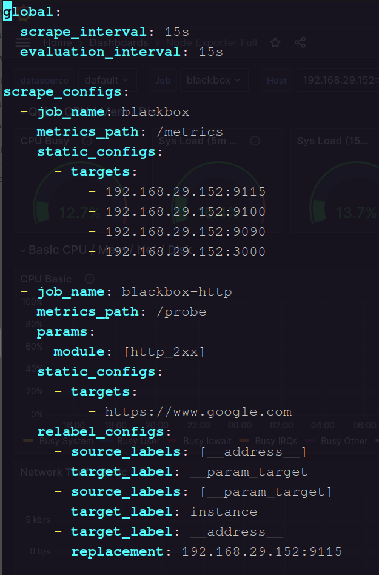
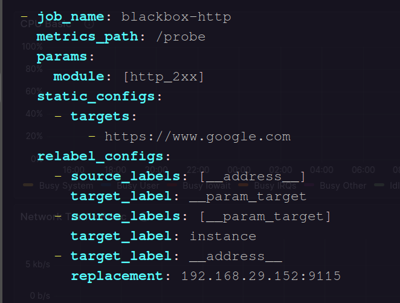
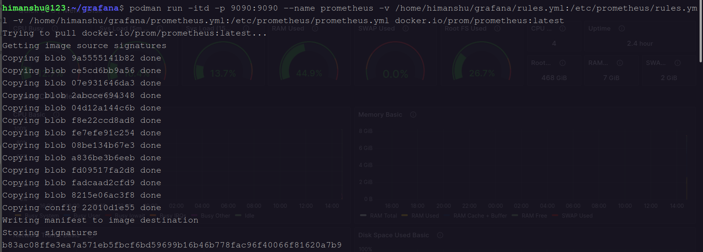
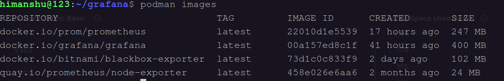
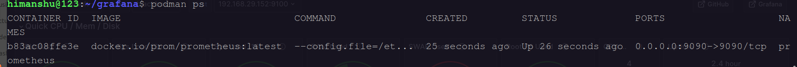
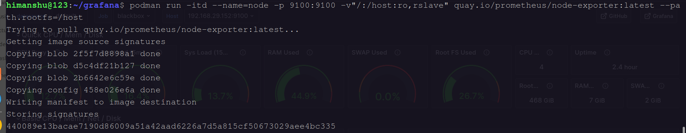
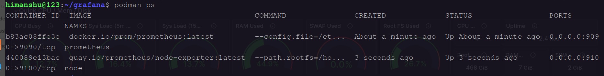
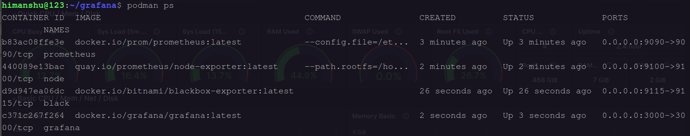
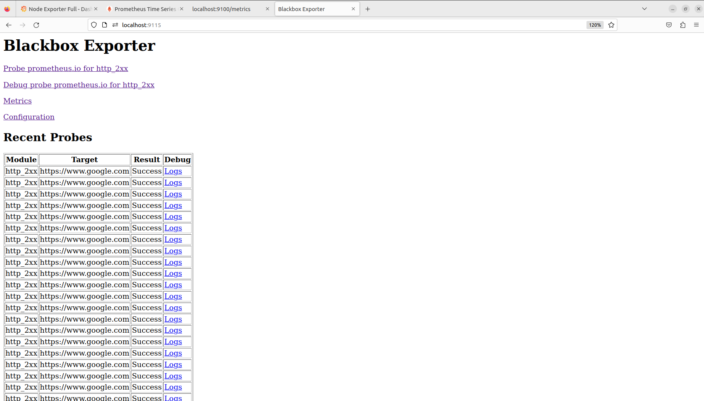

# <center><u>Set up Grafana , Prometheus  Node Exporter and Blackbox Exporter</u></center>   

### 1. Definition of Grafana , Prometheus  Node Exporter and Blackbox Exporter 


**<center>a. Grafana**: Grafana is an open-source analytics and monitoring platform that integrates with various data sources, allowing users to visualize and understand metrics through customizable dashboards.</center>


**<center>b. Prometheus:** Prometheus is an open-source monitoring and alerting toolkit designed for reliability and scalability. It collects and stores time-series data, offering powerful querying and alerting capabilities.</center>   

**<center>c. Node Exporter:** Node Exporter is a Prometheus exporter that gathers system-level metrics from Linux/Unix machines. It provides valuable insights into the performance and health of a server by exposing metrics like CPU usage, memory usage, and disk space.</center>   

**<center>d. Blackbox Exporter:** Blackbox Exporter is a Prometheus exporter designed for probing and monitoring external services. It allows users to check the availability and response of endpoints, such as HTTP, TCP, ICMP, and DNS, and generates metrics based on the results.</center>


### 2. How to set up Grafana , Prometheus , Node Exporter and Blackbox Exporter on Podman Container ?   

#### **System Requirement**  

* **Distributor ID:	Ubuntu**
  **Description:	Ubuntu 22.04.3 LTS**
  **Release:	22.04**
  **Codename:	jammy**     

* **podman version 3.4.4**
 
#### Step 1 . First, we will update and upgrade our system.   

* ```sudo apt update```    
  


* ```sudo apt upgrade```


#### Step 2 .   Create File and Folder regarding this set up .   

* ```mkdir Grafana```

* ```cd Grafana```      

* ```touch prometheus.yml```   

* ```touch rules.yml```   

* ```ls``` : **Check List**


    

#### Step 3 . Paste code in prometheus.yml and rules.yml file .   

* ```vim prometheus.yml```      


**Paste code in this configuration file .**

    global:
      scrape_interval: 15s
      evaluation_interval: 15s

    scrape_configs:
      - job_name: blackbox
        metrics_path: /metrics
        static_configs:
         - targets:
             - 192.168.29.152:9115
             - 192.168.29.152:9100
             - 192.168.29.152:9090
             - 192.168.29.152:3000

    - job_name: blackbox-http
      metrics_path: /probe
      params:
        module: [http_2xx]
      static_configs:
        - targets:
            - https://www.google.com
      relabel_configs:
        - source_labels: [__address__]
          target_label: __param_target
        - source_labels: [__param_target]
          target_label: instance
        - target_label: __address__
          replacement: 192.168.29.152:9115   


  
    

* ```vim rules.yml``` 

**Paste code in this configuration file .**

    - name: alert.rules
      rules:
      - alert: EndpointDown
        expr: probe_success == 0
        for: 10s
        labels:
           severity: "critical"
        annotations:
          summary: "URLs of {{ $labels.instance }} down"

      - alert: EndpointUP
        expr: probe_success == 1
        for: 10s
        labels:
          severity: "ok"
        annotations:
          summary: "URLs of {{ $labels.instance }} up"


    

#### Step 4 .  Run the container Prometheus on podman .    

* ```podman run -itd -p 9090:9090 --name prometheus -v /home/himanshu/grafana/rules.yml:/etc/prometheus/rules.yml -v /home/himanshu/grafana/prometheus.yml:/etc/prometheus/prometheus.yml docker.io/prom/prometheus:latest```     


        

* ```podman images``` : check images .   

   


* ```podman ps``` : check container .  

     

* show on Localhost : http://localhost:9090  

   

#### Step 5 .  Run the container Node Exporter on podman  .    

* ```podman run -itd --name=node -p 9100:9100 -v"/:/host:ro,rslave" quay.io/prometheus/node-exporter:latest --path.rootfs=/host```      


       


* ```podman images``` : check images .   


* ```podman ps``` : check container .  




* show on Localhost : http://localhost:9100  


#### Step 6 .  Run the container Blackbox Exporter on podman  .    

* ```podman run -d --name black -p 9115:9115  bitnami/blackbox-exporter:latest```    


            


* ```podman images``` : check images .   

   


* ```podman ps``` : check container .  

  


* show on Localhost : http://localhost:9115  

    


#### Step 7 .  Run the container Grafana on podman  .

* ```podman run -itd --name=grafana -p 3000:3000 docker.io/grafana/grafana```   


        

* ```podman images``` : check images .   


* ```podman ps``` : check container .  


* show on Localhost : http://localhost:3000  


